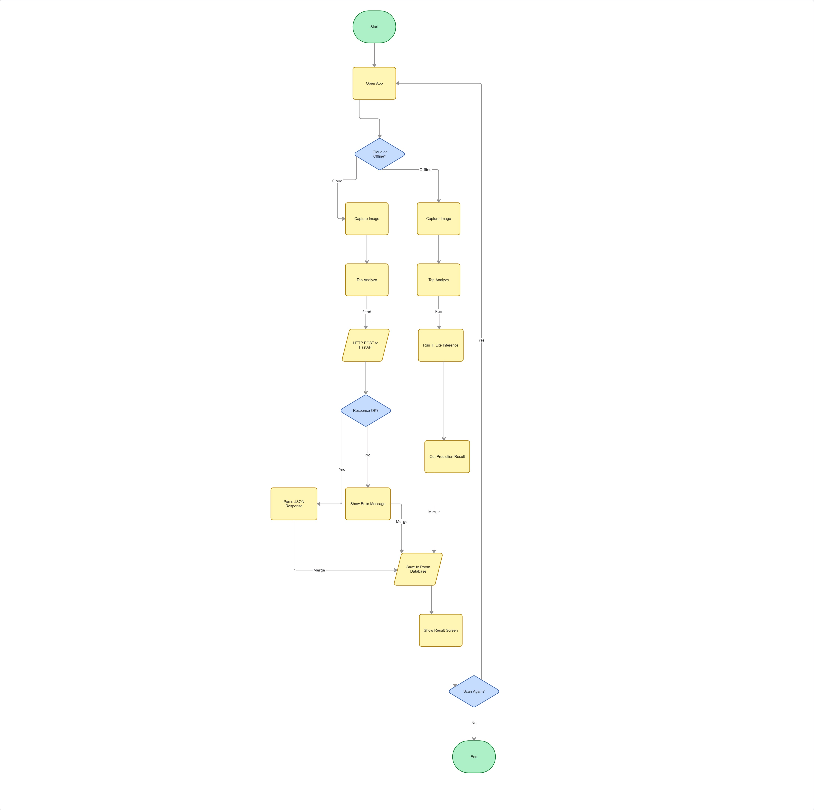

# Cropora

Cropora is a developing Android application for plant-leaf disease detection. The
planned workflow allows a user to capture a leaf photo or select one from the
device, analyze it through either a cloud service or an on-device model, and view
the predicted disease, confidence score, symptoms, treatment guidance, and
prevention information.

The project is being developed in stages. The Android interface, image-selection
flow, and initial FastAPI backend are available, while model integration and
several application features are still in progress.

> Cropora is an educational project and is not a substitute for diagnosis or
> advice from a qualified agricultural professional.

## Original product plan

Cropora is designed around two prediction paths:

- **Cloud Mode** — the Android app sends a leaf image as a multipart request to
  the FastAPI backend. The backend validates and preprocesses the image, runs a
  TensorFlow/Keras model, and returns a structured prediction.
- **Offline Mode** — the Android app runs a TensorFlow Lite model stored on the
  device, allowing predictions without an internet connection.

Both paths are intended to produce a common result containing the disease name,
confidence score, prediction mode, scan time, and image reference. A later stage
of the app will use this result to display disease guidance and save scan
history locally.



More detail about the original architecture is available in
[`docs/evidence/week-01/system-sketch.md`](docs/evidence/week-01/system-sketch.md).

## Current development status

| Component | Status | Notes |
| --- | --- | --- |
| Android project structure and screens | Implemented | Main, scan, result, history, disease library, settings, and analytics activities exist. Some screens are placeholders for later work. |
| Camera and gallery image selection | Implemented | The scan screen supports camera capture, gallery selection, image preview, permissions, and state restoration. |
| FastAPI backend structure | Implemented | Configuration, label loading, image validation, preprocessing, prediction response handling, and API tests are present. |
| Mock backend prediction | Implemented | Allows API development and testing without TensorFlow or a trained model. It is not a real diagnosis. |
| Real cloud prediction | Prepared, model required | The backend supports a Keras model, but `backend-api/models/cropora_model.keras` is not included. |
| Android-to-backend connection | Planned | Retrofit multipart upload and response mapping are part of the original design but are not connected in the Android app yet. |
| Offline TensorFlow Lite prediction | Planned | No `.tflite` model or Android inference integration is included yet. |
| Local scan history | Planned | The history screen exists, but Room database persistence is not implemented yet. |
| Local disease library | Planned | The screen exists, but the planned XML-backed Android library is not implemented yet. |

The backend includes 38 model labels. Reviewed symptom, treatment, and prevention
guidance is currently available for 10 classes; other recognized classes return
generic guidance until their content is added.

## Architecture


## Repository structure

```text
Cropora/
├── android-app-kotlin/   Kotlin Android application
├── backend-api/          FastAPI cloud-prediction service
└── docs/                 Architecture notes and development evidence
```

## Android application

### Requirements

- Android Studio with Android SDK 34
- JDK 11 or a compatible JDK supported by the configured Android Gradle plugin
- An Android device or emulator running API 24 or newer

### Run the app

1. Open `android-app-kotlin/` in Android Studio.
2. Allow Gradle to synchronize the project.
3. Select an emulator or connected device.
4. Run the `app` configuration.

You can also build from the command line:

```bash
cd android-app-kotlin
./gradlew assembleDebug
```

On Windows PowerShell, use `./gradlew.bat assembleDebug`.

The current Android build can capture or select an image and display its preview.
It does not yet send the image to the backend or perform local inference.

## Backend API

### Requirements

- Python 3.11
- A virtual environment is recommended
- TensorFlow is optional for mock-mode development and required for real model
  inference

### Setup

```bash
cd backend-api
python -m venv .venv
```

Activate the environment:

```bash
# Windows PowerShell
.\.venv\Scripts\Activate.ps1

# macOS or Linux
source .venv/bin/activate
```

Install the lightweight dependencies:

```bash
pip install -r requirements-base.txt
```

Copy `.env.example` to `.env`, then set `USE_MOCK=true` when running without a
real Keras model. Start the API with:

```bash
uvicorn main:app --reload
```

The service runs at `http://127.0.0.1:8000` by default. Interactive API
documentation is available at `http://127.0.0.1:8000/docs`.

### API endpoints

| Method | Endpoint | Purpose |
| --- | --- | --- |
| `GET` | `/` | Basic service health response |
| `GET` | `/health` | Runtime configuration and model-loading status |
| `GET` | `/diseases` | Reviewed disease guidance currently available from the backend |
| `POST` | `/predict` | Accepts an image in the multipart field `image` and returns a prediction |

The prediction response includes the model label, display name, confidence,
uncertainty status, guidance availability, symptoms, treatment, and prevention.

### Real model requirements

By default, the backend looks for:

```text
backend-api/models/cropora_model.keras
```

The expected model contract is:

- Input shape: `(None, 224, 224, 3)` unless `IMAGE_SIZE` is changed
- Output classes: 38, matching `backend-api/labels-38.txt`
- Input: RGB `float32` values in the range `[0, 255]`
- Preprocessing assumption: the current design expects the approved model to
  contain its own rescaling layer

Model and label ordering must match exactly. The model file is intentionally not
stored in this repository.

### Run backend tests

Install development dependencies and run the test suite:

```bash
pip install -r requirements-dev.txt
python -m unittest test_api.py
```

The tests cover health responses, label counts, mock prediction, image
preprocessing, unavailable-model handling, invalid uploads, and upload limits.

### Docker

Build a lightweight image for mock mode:

```bash
docker build -t cropora-api backend-api
```

To include TensorFlow dependencies for real inference:

```bash
docker build --build-arg INSTALL_TENSORFLOW=true -t cropora-api backend-api
```

The Keras model must be mounted or otherwise supplied at deployment time because
`models/*.keras` is excluded from the Docker build context.

## Development roadmap

The next planned integration steps from the original system design are:

1. Add and validate the trained Keras model for cloud inference.
2. Connect the Android scan flow to `POST /predict` using Retrofit.
3. Map cloud responses into a shared Android prediction-result model.
4. Add a matching TensorFlow Lite model and labels for Offline Mode.
5. Implement the result screen, Room-based scan history, and local disease
   information library.

These plans describe the intended direction of the developing product and may be
adjusted as implementation and model testing continue.
