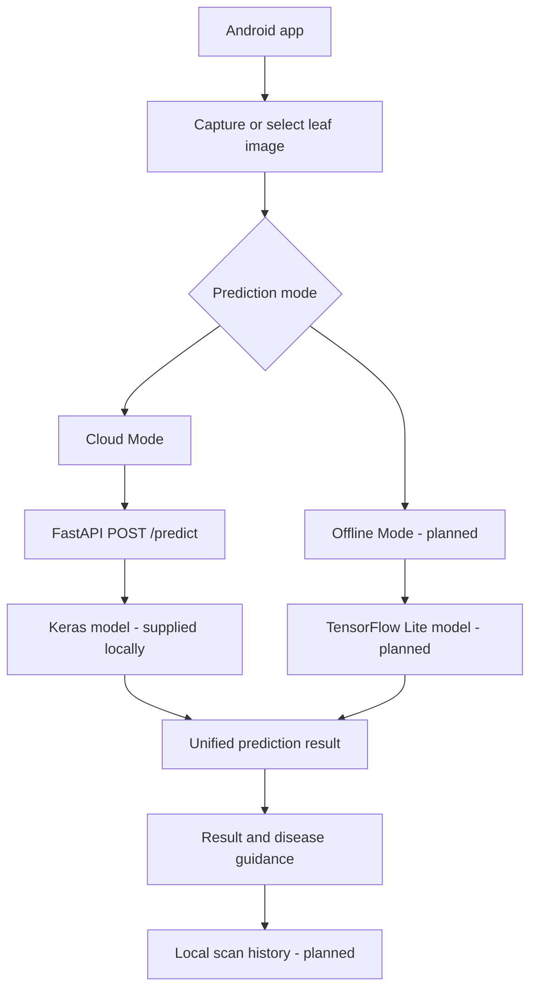

# Cropora

Cropora is a developing Android application for plant-leaf disease detection. The
planned workflow allows a user to capture a leaf photo or select one from the
device, analyze it through either a cloud service or an on-device model, and view
the predicted disease, confidence score, symptoms, treatment guidance, and 
prevention information.

The project is being developed in stages. The Android interface, image-selection
flow, and cloud API integration are available, with a Keras artifact supplied
locally. Reproducible model validation, offline inference, and several application
features remain in progress.

> Cropora is an educational project and is not a substitute for diagnosis or
> advice from a qualified agricultural professional. 

## Original product plan

Cropora is designed around two prediction paths:

- **Cloud Mode** — the Android app sends a leaf image as a multipart request to
  the FastAPI backend. The backend validates and preprocesses the image, runs a
  TensorFlow/Keras model, and returns a structured prediction.
- **Offline Mode** — the Android app runs a TensorFlow Lite model stored on the
  device, allowing predictions without an internet connection.

Both paths are intended to produce a common result containing the disease name,
confidence score, prediction mode, scan time, and image reference. A later stage
of the app will use this result to display disease guidance and save scan
history locally.


More detail about the original architecture is available in
[`docs/evidence/week-01/system-sketch.md`](docs/evidence/week-01/system-sketch.md).

## Current development status

| Component | Status | Notes |
| --- | --- | --- |
| Android project structure and screens | Implemented | Main, scan, result, history, disease library, settings, and analytics activities exist. Some screens are placeholders for later work. |
| Camera and gallery image selection | Implemented | The scan screen supports camera capture, gallery selection, image preview, permissions, and state restoration. |
| FastAPI backend structure | Implemented | Configuration, label loading, image validation, preprocessing, prediction response handling, and API tests are present. |
| Mock backend prediction | Implemented | Allows API development and testing without TensorFlow or a trained model. It is not a real diagnosis. |
| Real cloud prediction | Local artifact supplied | The model is available locally at `backend-api/models/cropora_model.keras`. Prior validation claims are recorded in the provenance file; they were not independently rerun in this documentation review. |
| Android-to-backend connection | Implemented | Retrofit uploads selected images to `POST /predict` and maps successful responses into the result screen. |
| Offline TensorFlow Lite prediction | Planned | No `.tflite` model or Android inference integration is included yet. |
| Local scan history | Planned | The history screen exists, but Room database persistence is not implemented yet. |
| Local disease library | Planned | The screen exists, but the planned XML-backed Android library is not implemented yet. |

The backend includes 38 model labels. Reviewed symptom, treatment, and prevention
guidance is currently available for 10 classes; other recognized classes return
generic guidance until their content is added.

## Architecture



## Repository structure

```text
Cropora/
├── android-app-kotlin/   Kotlin Android application
├── backend-api/          FastAPI cloud-prediction service and shared inference contract
├── docs/                 Architecture notes and development evidence
├── model/                Model inspection, contract tests, and model notes
└── release-records/      Model provenance and recorded approval claims
```

## Android application

### Requirements

- Android Studio with Android SDK 34
- JDK 17, as required by the configured Android Gradle plugin
- An Android device or emulator running API 24 or newer

### Run the app

1. Open `android-app-kotlin/` in Android Studio.
2. Allow Gradle to synchronize the project.
3. Select an emulator or connected device.
4. Run the `app` configuration.

You can also build from the command line:

```bash
cd android-app-kotlin
./gradlew assembleDebug
```

On Windows PowerShell, use `./gradlew.bat assembleDebug`.

The Android app uses `http://10.0.2.2:8000/` by default so an Android emulator
can reach a backend running on the development computer. To use a connected
physical device, bind Uvicorn to `0.0.0.0`, replace the host with the computer's
LAN address, and pass it as a Gradle property:

```bash
./gradlew assembleDebug -PCROPORA_API_BASE_URL=http://192.168.1.10:8000/
```

The device and development computer must be on the same network. The debug build
allows cleartext HTTP for local hosts; use HTTPS outside local development. Cloud
prediction is connected, while local inference remains planned.

## Backend API

### Requirements

- Python 3.11
- A virtual environment is recommended
- TensorFlow is optional for mock-mode development and required for real model
  inference

### Setup

```bash
cd backend-api
python -m venv .venv
```

Activate the environment:

```bash
# Windows PowerShell
.\.venv\Scripts\Activate.ps1

# macOS or Linux
source .venv/bin/activate
```

Install the lightweight dependencies:

```bash
pip install -r requirements-base.txt
```

For mock development, set these environment variables, or put them in
`backend-api/.env`:

```dotenv
USE_MOCK=true
IMAGE_SIZE=224
```

Mock mode must be enabled explicitly: the backend default is `USE_MOCK=false`.
Missing TensorFlow or a failed real-model load does not silently enable mock
predictions; real prediction remains unavailable.

For real mode, install `requirements.txt` instead of only the lightweight
requirements, set `USE_MOCK=false`, and supply the approved model described below.
Keep `IMAGE_SIZE=224`. `MODEL_PATH` and `LABELS_PATH` may override the default paths,
but must still satisfy the approved model and label contracts.

Start the API with:

```bash
uvicorn main:app --reload
```

For a physical Android device on the same network, listen on all interfaces:

```bash
uvicorn main:app --reload --host 0.0.0.0
```

The service runs at `http://127.0.0.1:8000` by default. Interactive API
documentation is available at `http://127.0.0.1:8000/docs`.

### API endpoints

| Method | Endpoint | Purpose |
| --- | --- | --- |
| `GET` | `/` | Basic service health response |
| `GET` | `/health` | Runtime configuration and model-loading status |
| `GET` | `/diseases` | Reviewed disease guidance currently available from the backend |
| `POST` | `/predict` | Accepts an image in the multipart field `image` and returns a prediction |

The prediction response includes the model label, display name, confidence,
uncertainty status, guidance availability, symptoms, treatment, and prevention.

For real-mode readiness, `/health` should report `use_mock=false`,
`model_loaded=true`, and `class_count=38`. These flags do not prove successful
inference, pinned artifact identity, or prediction accuracy. Preserve a separate
real-mode `/predict` response as smoke-test evidence.

### Real model requirements

By default, the backend looks for:

```text
backend-api/models/cropora_model.keras
```

An artifact has been supplied at this path in the current workspace. Local
presence does not establish version-control or release inclusion; provision the
approved artifact explicitly for other checkouts and deployments.

The expected model contract is:

- Framework dependency: TensorFlow 2.19.1; this is not a Keras version number.
- Exactly one `float32` input shaped `(None, 224, 224, 3)` or `(1, 224, 224, 3)`.
  The API sends one RGB image with raw values in `[0, 255]`.
- Exactly one `float32` output shaped `(None, 38)` or `(1, 38)`.
- Serving labels must match `backend-api/labels-38.txt` exactly in order; never
  sort them. `model/labels-38.txt` is the matching tooling copy.
- Embedded preprocessing must map raw RGB `[0, 255]` to `[-1, 1]`, whether expressed
  as Keras `Rescaling` or supported `Divide`/`Subtract` operations. Do not normalize
  pixels again in the caller.
- `IMAGE_SIZE` must remain `224` for the approved model.
- At prediction time, output must have shape `(1, 38)` and contain finite
  probabilities in `[0, 1]` summing to one within numerical tolerance. Invalid
  outputs are rejected, not silently clipped into confidence scores.

`backend-api/inference_contract.py` supplies the shared validation used by
`backend-api/model_loader.py` and the `model/model_contract.py` tooling facade.
The backend does not require the sibling `model/` directory at deployment time.
Runtime contract checks are distinct from the inspector's pinned size/SHA-256
check.

See [`model/model_notes.md`](model/model_notes.md) for inspection and test commands,
and [`release-records/model-provenance.txt`](release-records/model-provenance.txt)
for the source, pinned artifact identity, and historical approval assertions.
Pre-push static checks confirmed artifact size/SHA-256, matching label files,
Python syntax, and archive metadata. No tests or model inference were run;
prior runtime claims and prediction accuracy remain unverified.

### Run backend tests

From `backend-api/`, with the virtual environment active:

```bash
pip install -r requirements-dev.txt
python -m unittest discover -s . -p "test_*.py" -v
```

Discovery includes the API, shared-contract, and model-loader tests. Model tooling
tests check supplied-artifact identity without TensorFlow; structural artifact tests
skip when TensorFlow or the artifact is missing. A passing suite with
skips is not full artifact validation. Use the non-skipping inspector gate in
[`model/model_notes.md`](model/model_notes.md) for that check. These commands are
instructions, not evidence of execution in this review.

### Docker

From the project root, build and run a lightweight image for mock mode:

```bash
docker build -t cropora-api backend-api
docker run --rm -p 8000:8000 -e USE_MOCK=true cropora-api
```

`INSTALL_TENSORFLOW` defaults to `false`, but the backend's `USE_MOCK` default is
also `false`. The lightweight image therefore requires explicit `USE_MOCK=true`;
omitting TensorFlow does not select mock mode automatically.

For real inference, include TensorFlow and mount the externally supplied model
read-only. Replace `/absolute/path/to/cropora_model.keras` with its absolute host
path:

```bash
docker build --build-arg INSTALL_TENSORFLOW=true -t cropora-api backend-api
docker run --rm -p 8000:8000 -e USE_MOCK=false -e IMAGE_SIZE=224 --mount "type=bind,source=/absolute/path/to/cropora_model.keras,target=/app/models/cropora_model.keras,readonly" cropora-api
```

`models/*.keras` is excluded from the Docker build context, regardless of local
presence or version-control status. The canonical serving labels and shared
validator are inside `backend-api/`; no sibling `model/` mount is required.

## Development roadmap

The remaining integration and validation steps are:

1. Capture reproducible approved-artifact inspection and real-mode API evidence,
   including the already-connected Android scan flow and result mapping.
2. Add a matching TensorFlow Lite model and labels for Offline Mode.
3. Extend the existing result screen with Room-based scan history and a local
   disease information library.

These plans describe the intended direction of the developing product and may be
adjusted as implementation and model testing continue.
